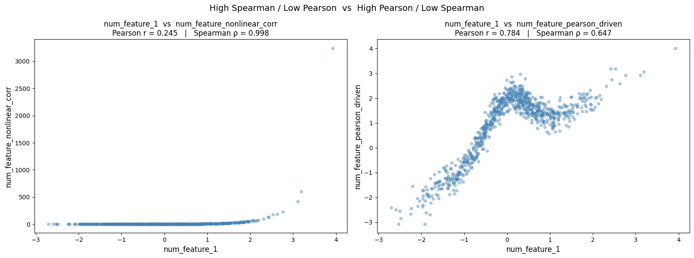

# Data Science stuff I wish I knew sooner: Initial Feature Elimination

> Part of the series *Data Science stuff I wish I knew sooner* — practical insights that
> are often glossed over in textbooks but matter a lot in production.

---

## Motivation

Lately  I started to think how often I appreciated online docs and guides (and many more tools I am not even mentioning) before the advent of generative AI. For this reason I felt I could have shared the stuff I learnt (or I am learning) during my work experience, with a personal touch. I am not creative enough with names, so I decided to call this series "Data Science stuff I wish I knew sooner".
It aims to provide insights and methodologies that are often overlooked in theoretical studies but are crucial for real-world success.

I remember playing with the Titanic (or any other similar) dataset early in my career, doing a few plots, and jumping
straight to model fitting. It took a few painful production incidents to teach me that the
feature set you feed the model matters as much as the model itself. ([Garbage in - Garbage out](https://en.wikipedia.org/wiki/Garbage_in,_garbage_out))

This article is about **Initial Feature Elimination**: the screening step you run *before*
any modelling, to remove features that are unstable, redundant, or misleading.
Done well it saves hours of debugging down the line and leads to models that actually
generalise.

The three techniques covered here are complementary - each catches a different class of problem:

| Technique | What it catches | When to use |
|---|---|---|
| **PSI** | Distribution drift between train and test/production | Always - before anything else |
| **Pearson / Spearman correlation** | Redundant numerical features | Before linear or tree-based models |
| **PhiK correlation** | Redundant categorical or mixed-type features | When the dataset contains categoricals |

The companion notebook [`1-Initial-Feat-Elimination.ipynb`](1-Initial-Feat-Elimination.ipynb)
implements every step on a synthetic dataset with intentional correlations and drift,
so you can see each method catch exactly the feature it was designed to flag.

---

## 1. Population Stability Index (PSI)

The PSI quantifies how much a variable's distribution has **shifted** between two
populations — typically your training window and your serving/test window.

```
PSI = Σ (Actual% − Expected%) × ln(Actual% / Expected%)
```

| PSI value | Interpretation | Action |
|---|---|---|
| < 0.10 | No significant shift | Keep |
| 0.10 – 0.25 | Moderate shift | Keep, but flag for monitoring |
| > 0.25 | Major shift | **Drop** |

### Why it matters

A feature with high PSI means the model was trained on a distribution it will never see
in production. Even a perfect model on training data will degrade fast if its features
behave differently in the wild. PSI is your early-warning system.

In the notebook we use [`feature_engine.selection.DropHighPSIFeatures`](https://feature-engine.trainindata.com/en/1.8.x/user_guide/selection/DropHighPSIFeatures.html)
with a threshold of 0.25:

```python
from feature_engine.selection import DropHighPSIFeatures

drop_psi = DropHighPSIFeatures(threshold=0.25, missing_values='ignore', split_frac=0.8)
drop_psi.fit(X=dataset)

print(drop_psi.features_to_drop_)   # ['num_feature_2']
print(drop_psi.psi_values_)
```

On stable data no feature is flagged. Once we simulate a drift on `num_feature_2`
(multiplying training values by 10 000 000), PSI jumps to >> 0.25 and the feature is
correctly identified for removal.

---

## 2. Numerical Correlation

High correlation between two features means they carry largely the same information.
Keeping both wastes capacity and, in linear models, causes multicollinearity.


### Pearson — linear relationships

Pearson r measures the **strength of the linear relationship** between two variables.
Values close to ±1 indicate a strong linear association.

```python
pearson_corr = dataset_train[num_cols].corr(method='pearson')
```

**When it matters most:** linear models (Logistic Regression, Linear Regression).
Two features with |r| > 0.9 are redundant for a linear model — drop one.

### Spearman — monotonic relationships

Spearman ρ measures the **strength of the monotonic relationship** — one variable
consistently increases as the other does, but not necessarily at a constant rate.

```python
spearman_corr = dataset_train[num_cols].corr(method='spearman')
```

**When it matters most:** tree-based models (Random Forest, GBM). 
Trees based rely on finding complex, often non-linear signals within the data, that's why they are immune to linear collinearity but redundant *monotonic* features still slow
training and hurt feature-importance interpretability. Spearman captures non-linear
monotonic relationships that Pearson misses.
And in general I always think it is better to have as much as needed to do something [Occam’s Razor principle](https://en.wikipedia.org/wiki/Occam%27s_razor])

### The scenario where Pearson and Spearman diverge

I once found, to my surprise, that the two metrics can disagree significantly on the
same pair of features. In my head if there is a linear relationship for sure also a monotonic one holds. 

There is the need of some complex functions, but in the notebook there are two toy examples to make this concrete:



**Case A — high Spearman, low Pearson**

```python
# y = exp(2x + noise)  — strictly monotonic, but non-linear in value
num_feature_nonlinear_corr = np.exp(NL_SCALE * x + np.random.randn(N) * NL_NOISE_STD)
```

`exp(x)` is strictly monotonic (every rank is preserved → Spearman ≈ 1.0), but the
relationship is exponential so a straight line fits it poorly (Pearson ≈ 0.27).
A Spearman screen catches the redundancy; Pearson alone would miss it.

**Case B — high Pearson, lower Spearman**

```python
# y = x + bump * exp(-x²/width) + noise
# Gaussian bump creates rank inversions near x=0
num_feature_pearson_driven = (
    x
    + NL2_BUMP_AMP * np.exp(-x**2 / NL2_BUMP_WIDTH)
    + np.random.randn(N) * NL2_NOISE_STD
)
```

A Gaussian bump centred at x=0 inflates the y values of typical (middle) x values
above where extreme x values land. Extreme (x, y) pairs remain linear, keeping Pearson
strong (≈ 0.78). But middle-x values end up with a higher y rank than larger-x values —
rank inversions that suppress Spearman (≈ 0.65).

The scatter plots below show both cases side by side:

| | Pearson r | Spearman ρ |
|---|---|---|
| `num_feature_nonlinear_corr` | 0.27 | 1.00 |
| `num_feature_pearson_driven` | 0.78 | 0.65 |

**Rule of thumb:**
- Use **Pearson** to screen redundancy for linear models.
- Use **Spearman** to screen redundancy for tree-based models.
- Run **both** and compare — the gap tells you about the shape of the relationship.

```python
plotter.plot_comparison_heatmaps(
    pearson_corr, spearman_corr,
    title_a="Pearson", title_b="Spearman",
    suptitle="Pearson vs Spearman — all numerical features",
)
```

---

## 3. Categorical Correlation: PhiK

Assessing the relationship between categorical variables — or between a categorical and
a numerical variable — requires a different metric. Standard Pearson / Spearman don't
apply to nominal categories.

**PhiK** is a correlation metric that works for all feature types (numerical, categorical,
and mixed). For two categorical variables it is based on an advanced version of the
chi-squared test, scaled to [0, 1].

```python
phik_overview = dataset_train.phik_matrix(interval_cols=interval_cols, dropna=True)
```

| PhiK | Interpretation |
|---|---|
| < 0.15 | Negligible association |
| 0.15 – 0.50 | Moderate — worth investigating |
| > 0.50 | Strong — consider dropping one of the pair |

### Always check significance

A high PhiK on a small sample can be spurious. The library provides a significance
matrix (in units of σ) to validate that the correlations are not noise:

```python
significance_overview = dataset_train.significance_matrix(interval_cols=interval_cols)
```

Only drop a feature pair when **both** PhiK is high **and** significance is well above
your threshold (e.g. 3σ).

In our dataset `cat_feature_corr` ↔ `cat_feature_1` shows PhiK ≈ 0.41 — moderate and
significant, exactly as expected since we built `cat_feature_corr` to depend on
`cat_feature_1`.

---

## Running the notebook

```bash
cd 1-initial-feat-elimination
uv sync
uv run jupyter notebook
```

Or, in VS Code: open the `.ipynb` file, select the `.venv` kernel from the kernel picker.

---

## References

- [feature-engine — DropHighPSIFeatures](https://feature-engine.trainindata.com/en/1.8.x/user_guide/selection/DropHighPSIFeatures.html)
- [feature-engine — DropCorrelatedFeatures](https://feature-engine.trainindata.com/en/latest/user_guide/selection/DropCorrelatedFeatures.html)
- [PhiK paper (Baak et al., 2019)](https://arxiv.org/abs/1811.11440)
- [PhiK tutorial notebook](https://colab.research.google.com/github/KaveIO/PhiK/blob/master/phik/notebooks/phik_tutorial_basic.ipynb)
