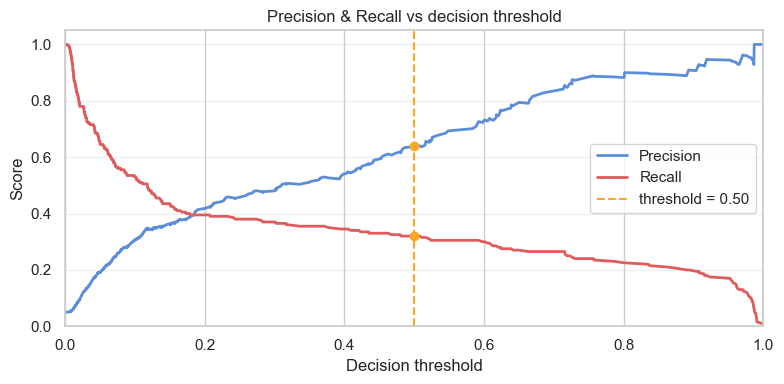
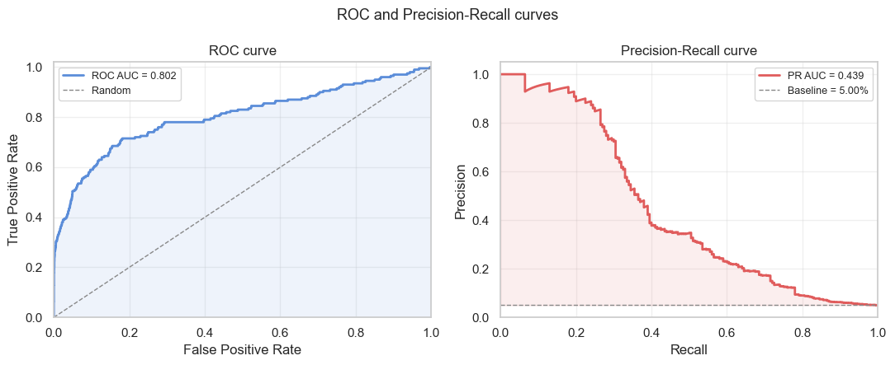
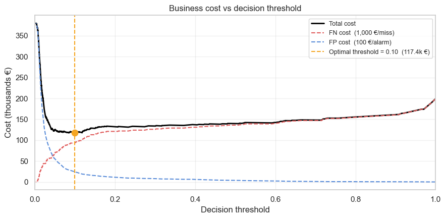
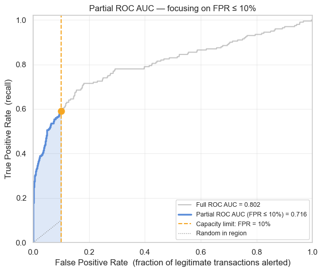

# Data Science stuff I wish I knew sooner: Binary Classification Metrics


When I started with binary classifiers I thought the model magically would spit out only a 0 or 1. From those outputs a few simple metrics such as recall and precision could have been calculated. Many discussion with the business for the performances were related to recall or the precision, indeed those are direct and easy to interpret metrics. 

This was only a partial picture. Because models can output scores and different thresholds might lead to have different distibution of 0 and 1 in your outputs. This can make you achieve high metrics considering the stakholder requests, but having a very high recall might hide a s**tty precision and vice versa.

But once again that is not the whole picture about the problems and those point value metricsweren't enough.

---

## 1. The threshold trap

Most of the binary classifier are able to output a score, and you need to draw a line somewhere to convert that score into a decision. The default line is almost always `0.5`, but that is a
convention, not an optimal choice. `0.5` can be especially wrong for imbalanced problems where the output score will never be balanced and a differnt threshold can be more effective.
(To have a binary problem perfectly balanced you have to create it artificially, it will never happen in real case scenarios )

Consider a fraud dataset where only 5 % of transactions are fraudulent, a model outputting `P(fraud) = 0.3` is actually saying it is *six times more likely* than the base rate. Yet the 0.5 threshold silently classifies it as legitimate.




**Precision and recall at a fixed threshold** give you one operating point:

```python
# Everything you know at threshold = 0.5
print(classification_report(y_test, model.predict(X_test)))
```

That is one row of a much larger table. Moving the threshold left or right traces a curve.
A single row tells you almost nothing about the shape of that curve.

---

## 2. Seeing the whole curve: ROC AUC and PR AUC

The solution is to evaluate the model's discrimination power **across all thresholds at once**.




### ROC AUC
The ROC curve plots True Positive Rate (recall) against False Positive Rate at every
possible threshold. The area under it "ROC AUC" (AUC -> area under the curve) has a clean probabilistic interpretation:
the probability that a randomly chosen positive is scored higher than a randomly chosen
negative.

- **Perfect model**: 1.0
- **Random classifier**: 0.5

ROC AUC is widely used and easy to communicate. Its weakness is that the denominator of
FPR (false pos ratio) is the count of *true negatives*, which is huge in imbalanced datasets. A model can
achieve ROC AUC > 0.95 while still missing the large majority of fraud cases.


It is the classic scenario in which the model on a very imbalanced dataset, outputting always zero will still show a high performance, because it is getting correctly most of the outputs. Sometimes this high performances cannot be connected with a high business value, because it might be linked to huge losses still.


### PR AUC (average precision)
The PR curve plots Precision against Recall, in one plot you will have the 2 most interpretable metrics for stakeholders related to the binary models. It focuses entirely on the positive class.
The baseline for a random classifier is the prevalence (5 % in our example) rather than
0.5, which makes it far more sensitive to how well the model finds the rare positives.
( in scikit learn you will never find the name prauc but always referred as [average precision](https://scikit-learn.org/stable/modules/generated/sklearn.metrics.average_precision_score.html) )
```python
from sklearn.metrics import roc_auc_score, average_precision_score

print(f"ROC AUC : {roc_auc_score(y_test, y_proba):.4f}")
print(f"PR  AUC : {average_precision_score(y_test, y_proba):.4f}")
```

| Metric | Use when … | Watch out for … |
|---|---|---|
| **ROC AUC** | Classes roughly balanced; you care about overall ranking quality | Inflated by many true negatives in imbalanced datasets |
| **PR AUC** | Positive class is rare and precision matters (fraud, medical diagnosis) | Sensitive to prevalence |

For fraud detection (or any other problem where finding a true positive matters most), **PR AUC is the recommneded metric**. My suggestions is to consider both, but make decisions
on PR AUC (of course there might be exceptions :) ).

---

## 3. Translating errors into euros: the cost of FP and FN

AUC metrics are dimensionless ranking scores. They tell you which model is better at ranking predictions (the riskier -> the higher the score); they do not tell you *what threshold to deploy in production*. For that you need business knowledge. In this dummy scenario we consider the `cost`, because often the main objective of a project is cost optimization/saving.

In fraud the asymmetry is extreme:

| Error | What happens | Typical cost |
|---|---|---|
| **False negative** (missed fraud) | Bank absorbs the full transaction loss | 1 000 € |
| **False positive** (false alarm) | Manual review (operational cost) + customer friction | 100 € |

The optimal threshold minimises the **expected total cost** over the test set:

```python
total_cost(t) = FN(t) × fn_cost + FP(t) × fp_cost
```

where `FN(t)` and `FP(t)` are the number of false negatives and false positives at
threshold `t`.

Plotting this function reveals an operating point that is rarely at 0.5. When
`fn_cost >> fp_cost` the optimal threshold is well below 0.5 — you accept more false
alarms to avoid missing fraud. When costs are equal, precision and recall should be
balanced.




---

## 4. Additional constraints: When you can only manually review the top N cases: Partial ROC AUC

Both ROC AUC and the cost curve assume you can action every alert the model generates.
Real fraud teams have a **finite review capacity**: maybe 250/500 alerts per day or a specific percentage wrt all incoming workload. Beyond that limit, extra alerts pile up unreviewed, or worse, the threshold is raised until the queue clears, discarding the model's calibration.

When capacity is constrained, the relevant question is not "what is the model's overall
ranking quality?" but **"how good is the model in the top-N region where we will actually
operate?"**

### Partial ROC AUC



`sklearn` exposes this via the `max_fpr` parameter of `roc_auc_score`:

```python
partial_auc = roc_auc_score(y_test, y_proba, max_fpr=0.10)
```

This measures the area under the ROC curve restricted to FPR ≤ `max_fpr`.

### How to determine `max_fpr` from capacity

FPR is defined as:

```
FPR = FP / N_neg
```

At the operating threshold where the model fires exactly `C` alerts (your capacity limit):

```
C = TP + FP   →   FP = C - TP
FPR = (C - TP) / N_neg
```

Since TP is unknown before evaluating the model, use the **conservative upper bound**
(`TP = 0`, worst case where all capacity is consumed by false positives):

```
max_fpr = C / N_neg
        = daily_review_capacity / (total_daily_transactions × (1 − fraud_rate))
```

If capacity is expressed as a **flagging rate** `k` (fraction of all transactions alerted)
rather than an absolute count, substitute `C = k × N_total` and `N_neg = (1 − p) × N_total`:

```
max_fpr (upper bound) = k / (1 − p)
```

This is what you pass to `roc_auc_score(..., max_fpr=...)`. The actual FPR at your
operating point will always be **≤ max_fpr**, because in reality some of the `C` reviews
will be true positives, leaving fewer slots for false positives.

#### The lower bound: minimum FPR at a given flagging rate

There is a second formula worth knowing — the FPR you would achieve if the model were
**perfect** (all fraud ranked first, recall = 100 % within the top-k). Once the top-k
bucket has absorbed all `p × N` fraud cases, every remaining alert is a false positive:

```
min_fpr (lower bound) = (k − p) / (1 − p)       [valid when k ≥ p]
```

Together, the two formulas bracket the range of possible FPRs for a given capacity:

| | Formula | Assumes |
|---|---|---|
| **Upper bound** — use as `max_fpr` | `k / (1 − p)` | Model finds zero fraud in top-k (worst case) |
| **Lower bound** — theoretical floor | `(k − p) / (1 − p)` | Model finds all fraud in top-k (perfect recall) |

The lower bound is useful as a sanity check: if `k < p`, your capacity is not even enough
to flag all fraud at perfect precision, and the formula returns a negative number —
a signal to renegotiate the capacity budget.

#### Concrete example

```
N_total = 10 000,  p = 0.05,  N_neg = 9 500

Capacity as absolute count:  C = 200 reviews/day
  → k = 200 / 10 000 = 2 %
  → max_fpr (upper) = 200 / 9 500 ≈ 0.021
  → min_fpr (lower) = (0.02 − 0.05) / 0.95 < 0  ← capacity below fraud rate, impossible to catch all

Capacity as flagging rate:  k = 10 %
  → max_fpr (upper) = 0.10 / 0.95 ≈ 0.105
  → min_fpr (lower) = (0.10 − 0.05) / 0.95 ≈ 0.053
```

Use `k / (1 − p)` as the `max_fpr` argument to sklearn.

200 / 9 500 ≈ 0.021`.

#### Is there an equivalent metric?
Something very similar can be the precision at top k%. Because with the partial ROC we are optimizing the precision in that specific area. 

Usually if I have to decide between an area metric and a point metric, I would opt for the area one that can be more telly of the whole picture.

But apart from this I think both metrics will work great on such problem.

### Why it matters for model selection

Two models with identical full ROC AUC can behave very differently in the constrained
region. Model A might front-load its true positives (high partial AUC) while Model B
distributes them uniformly (low partial AUC in the region you care about). Choosing
Model B based on full AUC can be (depending on the scenario) a costly mistake.

| Metric | What it tells you | When to use it |
|---|---|---|
| **ROC AUC** | Overall ranking quality | Model selection with no ops constraint |
| **PR AUC** | Precision-recall trade-off for rare positives | When both precision and recall matter across thresholds |
| **Partial ROC AUC** | Ranking quality in the high-precision, low-FPR region | When the team can only action a fixed top-N alert list |

---

## Running the notebook

```bash
cd 2-classification-metrics
uv sync
uv run jupyter notebook
```

Or in VS Code: open `2-Classification-Metrics.ipynb` and select the `.venv` kernel.

---

## References

- [scikit-learn — `roc_auc_score` with `max_fpr`](https://scikit-learn.org/stable/modules/generated/sklearn.metrics.roc_auc_score.html)
- [scikit-learn — `average_precision_score`](https://scikit-learn.org/stable/modules/generated/sklearn.metrics.average_precision_score.html)
- [The Relationship Between Precision-Recall and ROC Curves (Davis & Goadrich, 2006)](https://dl.acm.org/doi/10.1145/1143844.1143874)
