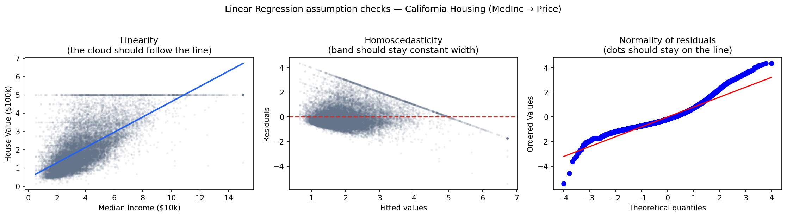
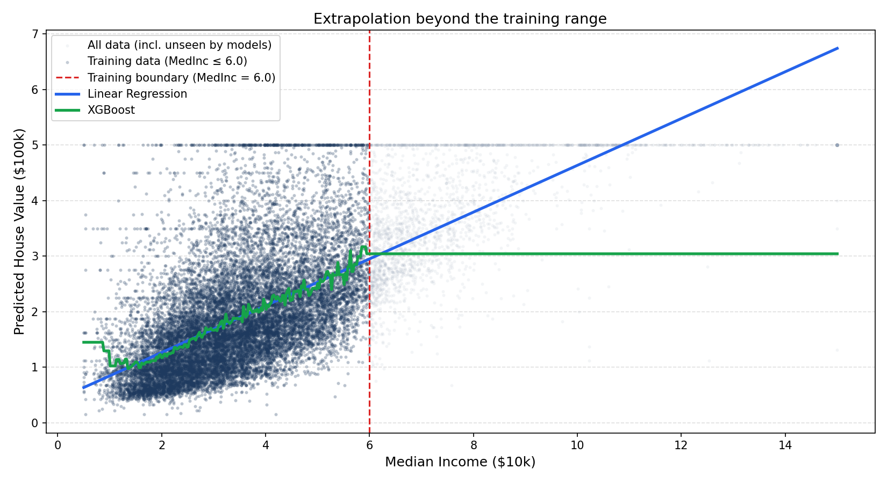

# Data Science stuff I wish I knew sooner: Boosting regressors vs linear regression, which is better?

When I started doing regression problems the first model I worked with is linear regression. It is the first model you learn, it is fast, and the coefficients are interpretable. But every time I used it I was silently signing a contract with five assumptions I was not (almost) always checking. And I am pretty sure every time I was forgetting about one of them (at least).

The relationship has to be linear. The residuals have to be normally distributed. Their variance has to be constant. The observations have to be independent. The features cannot be too correlated with each other. In real case scenario tabular data, most of those are violated to some degree. 

At some point I stopped treating linear regression as the default and started treating XGBoost as the default. It makes none of those assumptions. It learns the function directly from the data.

But XGBoost is not free either. There is one limitation that tripped me up in production and that is easy to overlook: it cannot predict outside the range of values it saw during training. 

---

## 1. The assumption trap

Initially I was treating Linear regression as just a model, but actually it is more a statistical procedure built on top of assumptions. When those assumptions hold, OLS gives you the best linear unbiased estimator (BLUE). When they do not, your coefficients are still computable but the guarantees disappear.

The three easiest to check visually:

- **Linearity**: plot feature vs target. If the cloud does not follow a line, a line will not fit well.
- **Homoscedasticity**: plot residuals vs fitted values. The band should stay constant width. If it fans out, your standard errors are wrong.
- **Normality of residuals**: a QQ plot should stay on the diagonal. Heavy tails mean outliers are distorting the fit more than they should.

On the California Housing dataset, all three are violated even on the cleanest single-feature relationship (median income vs house price).

In this case there are several procedures that can be done for processing the data and make those assumptions hold, maybe it will be describe more in detail in another article.

---

## 2. XGBoost: no assumptions, (also fits nonlinear patterns)

Gradient boosting builds an ensemble of decision trees. Each tree partitions the feature space into rectangular regions and assigns a constant prediction to each region. The final output is the sum across all trees. Nothing in this process requires linearity, normality, or constant variance.

On the same single-feature problem, XGBoost explains substantially more variance than linear regression — without any preprocessing, feature engineering, or hyperparameter search.

---

## 3. The extrapolation problem

Here is the part I wish someone had shown me earlier.

Each split in each tree is a threshold learned from training data. For any input value that falls *above* the maximum value the model saw during training, every tree falls into its rightmost leaf — the constant assigned to the highest bin. The prediction does not increase. It does not decrease. It is frozen.

The chart below shows this clearly. Both models are trained only on houses with median income ≤ $60k. Then we ask them to predict for income values up to $150k.

Linear regression continues the trend (whether correctly or not). XGBoost flatlines exactly at the training boundary and stays there no matter how much higher the input goes.

The table in the notebook makes it explicit: from the training cap onward, every XGBoost prediction is identical.

---

## What to do about it

You can use other models, such as our old friend linear regression.

Or, if you like more xgb, it is a reason to check your feature distributions before deploying.

Before shipping a tree-based model:
1. Record the min and max of every feature in your training data.
2. At inference time, monitor whether incoming values fall outside that range.
3. If they do, either retrain on data that covers the new range, or document that predictions for out-of-range inputs are unreliable.

The model will not error. It will return a confident number, which might be over/underestimated
