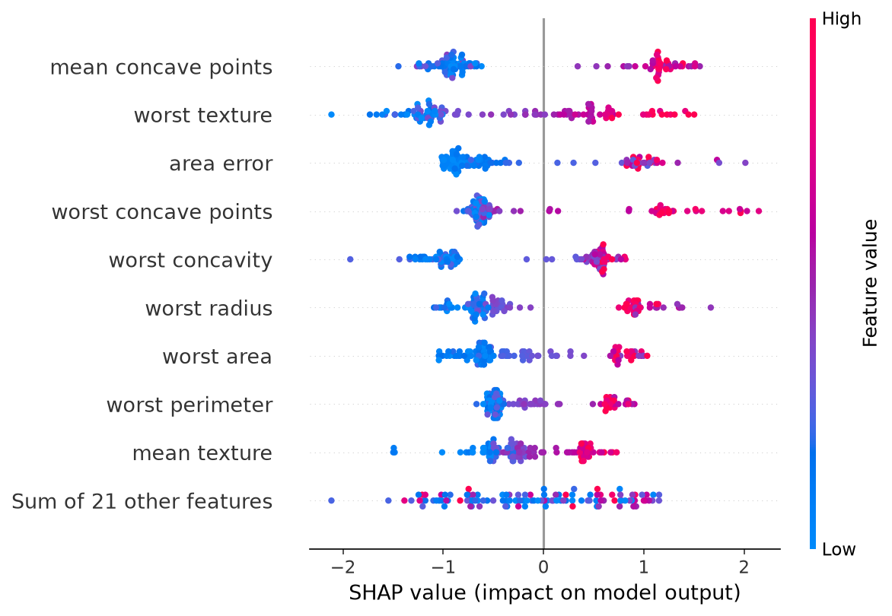
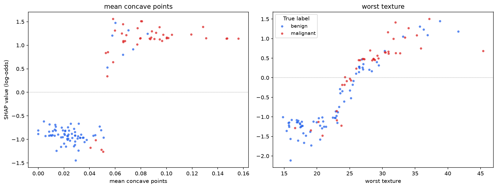
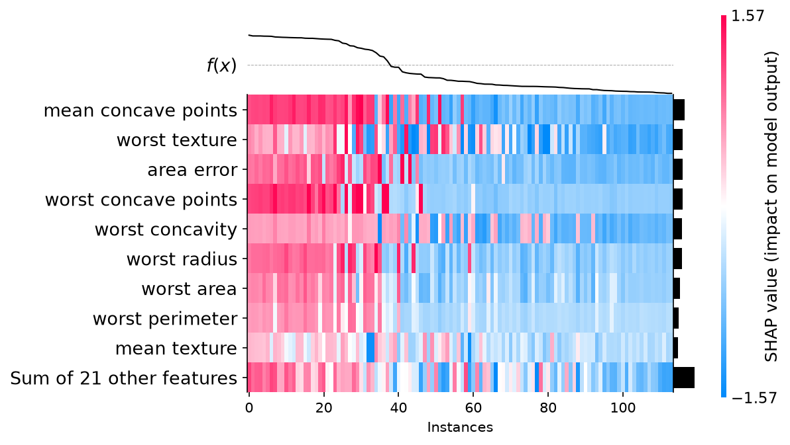
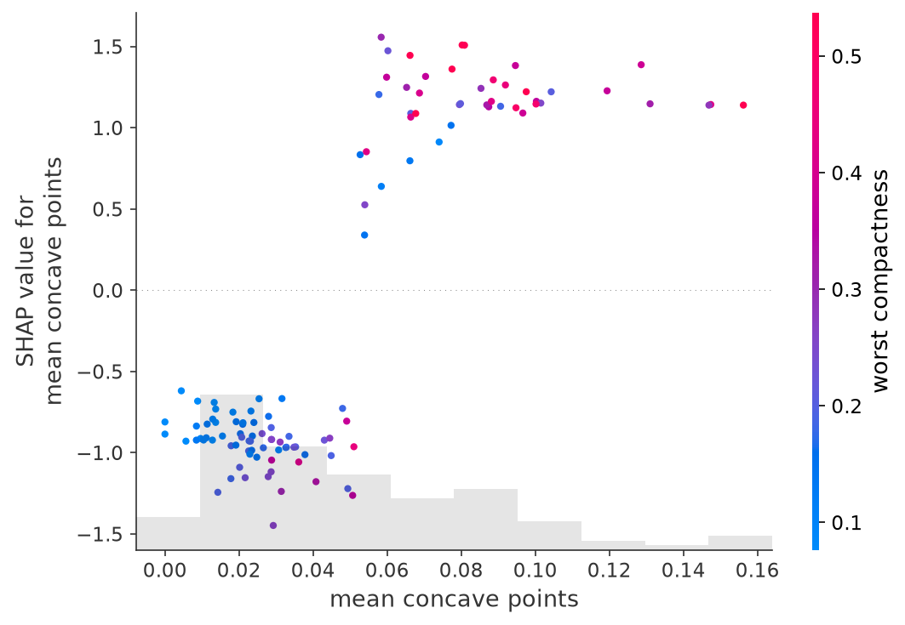
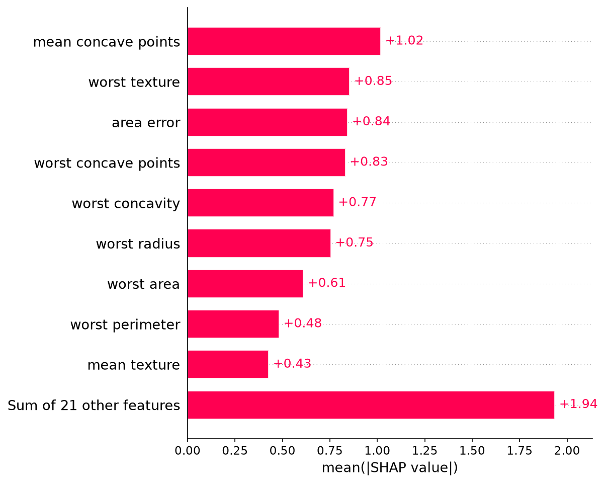
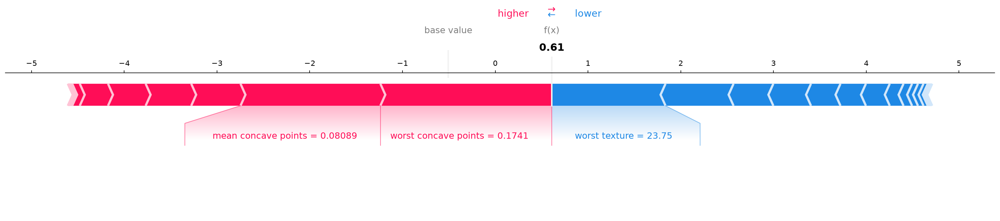
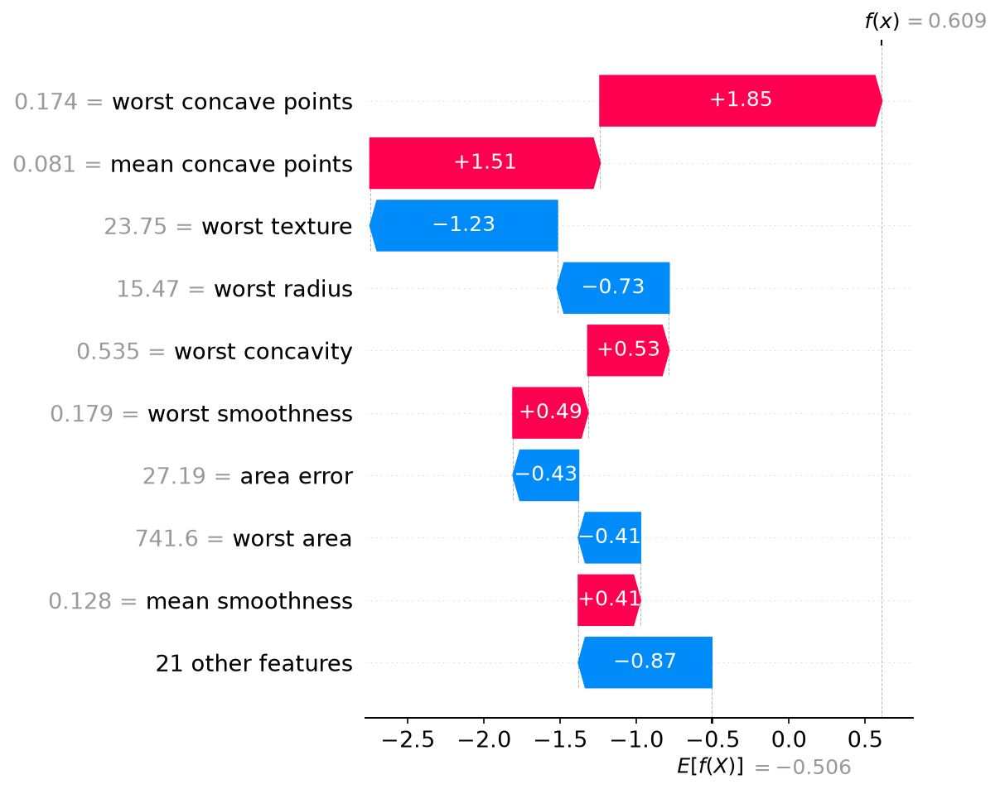
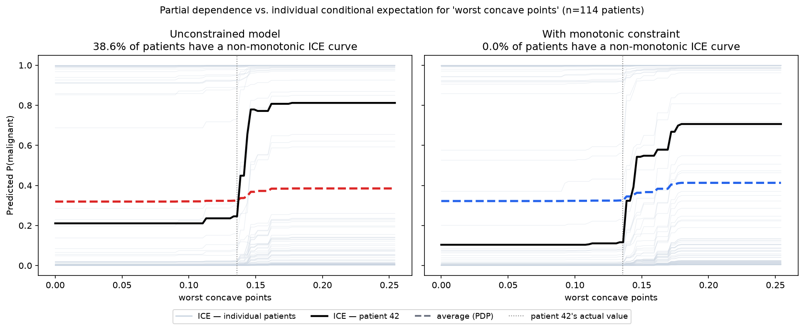

# Data Science stuff I wish I knew sooner: Model Explainability with SHAP and Monotonic Constraints

---

## Context

For a long time my idea of "explaining a model" was a feature importance bar chart, screenshotted
into a slide, mentioned once, and never opened again. It answers "what does the model use overall" during the training, but it stops right there. The question that actually comes up in a review "why did the model say
**this** about **this specific case**" has no answer in a bar chart, and at the time I had no idea how to reply. 

That gap is what [SHAP](https://github.com/shap/shap) closes: instead of one importance number per
feature, you get a number **per feature, per row**, and those numbers add up exactly to the model's
prediction. Global summary and single-case explanation from the same, consistent accounting. [If you want to konw more about shap story](https://en.wikipedia.org/wiki/Shapley_value) and about [Shapley Lloyd](https://en.wikipedia.org/wiki/Lloyd_Shapley)

For this article I chose the Breast Cancer Wisconsin dataset, trained xgboost, extracts SHAP
values, and walks through the SHAP plots I reach for most: **beeswarm**  (yes, the name comes from the swarms of bees), **heatmap** and **dependence** plots (debugging a specific feature or subgroup), **bar
chart** (ranked importance), and **force** / **waterfall** plots (one prediction, fully decomposed).
I will explain all those plots, but I have to admit that 99% of time I only use the beeswarm to have a full picture of the dataset explainability and the force plot or waterfall for the cherrypicking ona single case.

Then I introduce the concept  **monotonic constraints**: a way to tell XGBoost "I already know which direction this feature should push the prediction, don't second-guess it," verified with scikit-learn's partial dependence / ICE tooling.

The companion notebook
[`4-Model-Explainability-With-SHAP-and-Monotonic-Constraints.ipynb`](4-Model-Explainability-With-SHAP-and-Monotonic-Constraints.ipynb)
implements every step end to end, with real numbers from a real (if small and clean) dataset — no
synthetic examples built to make the point look better than it is.

---

## Dataset

[Breast Cancer Wisconsin (Diagnostic)](https://scikit-learn.org/stable/datasets/toy_dataset.html#breast-cancer-wisconsin-diagnostic-dataset),
loaded directly from `sklearn.datasets` — 569 rows, 30 numerical features describing cell nuclei
from digitised breast mass images (`mean`, `standard error`, and `worst` value for radius, texture,
perimeter, area, smoothness, concavity, ...). The target is flipped from scikit-learn's default so
that **`1` means malignant**, the class you actually want to catch, which keeps every SHAP value
in the "pushes risk up / pushes risk down" direction you'd intuitively expect.


---

## 1. What a SHAP value actually is

SHAP borrows the **Shapley value** from cooperative game theory: treat each feature as a player
contributing to the prediction, and split that prediction fairly across the players based on their
average marginal contribution across every possible ordering in which they could be revealed. The
result is additive:

```
f(x) = base_value + Σ shap_value(feature_i)
```

`base_value` is the average model output over the training set (what you'd predict knowing nothing
about the row). Each SHAP value moves the prediction up or down from there, and they always sum back
to the model's exact output — not an approximation.

For tree ensembles, `shap.TreeExplainer` computes these values **exactly**, in polynomial time, by
exploiting the tree structure, instead of the exponential brute-force game-theory computation, or
the sampling-based approximation that model-agnostic explainers (`KernelExplainer`) need. This is why
SHAP and gradient boosting are used together so often: for trees, "exact and interpretable" isn't a
trade-off you have to make.

```python
explainer = shap.TreeExplainer(model)
shap_values = explainer(X_test)
```

---

## 2. The global view: the beeswarm plot

Every dot is one test-set row. Its x-position is the SHAP value (how much that feature pushed *this*
prediction); its colour is the feature's own value (red = high, blue = low); features are ranked
top-to-bottom by overall impact. 

```python
shap.plots.beeswarm(shap_values)
```



* `mean concave points` is the single most influential feature, and a clean one, high values (red)
push hard toward malignant (right), low values (blue) push hard toward benign (left), with almost no overlap between
the two clusters. Most of the top features look like this, hinting to a clear split related to the feature value.

* `worst texture` doesn't. It's the only top feature with dots of *both* colours scattered across the
*whole* x-axis range, a visible sign that its relationship with risk is less tidy than the purely
geometric features. Not every feature the model relies on behaves as tidily as the top one.

The beeswarm plot is a great overview on how the model intepret the risk, but it can't answer all questions model related.  
* *does a feature's push toward risk actually line up with the true outcome, or does it just look clean?*, 
* *is this specific feature's relationship with risk actually as clean as it looks, or is another feature quietly interacting with it?*

### 2a. Checking a feature against the ground truth: the label-coloured scatter

The beeswarm colours each dot by the feature's *own value* — good for reading the trend, silent on
whether that trend actually tracks the true diagnosis. Keep the same axes (one feature's value against
its own SHAP value) but colour by the **true label** instead, and the plot answers a sharper question:
for this feature alone, does a push toward malignant actually line up with malignant patients, or is it
a smooth-looking trend with the two classes tangled up inside it?

```python
plt.scatter(X_test[feature], shap_values[:, feature].values, c=y_test.map({0: "#2563eb", 1: "#dc2626"}))
```



* `mean concave points` splits almost perfectly along the colour: below the gap in the trend (around
0.05) the points are almost entirely benign (blue), above it almost entirely malignant (red). This one
feature's sign alone — nothing else about the patient — agrees with the true label on **90.4%** of test
set rows.

* `worst texture` shows exactly the smooth, monotonic-looking climb its colour implied in the beeswarm,
no jump, no gap. But look at the middle of the range (roughly 20–30): benign (blue) and malignant (red)
patients sit on top of each other for the whole stretch, and the feature's sign alone agrees with the
true label on only **71.9%** of rows. The beeswarm's "both colours everywhere" observation wasn't just
the interacting feature muddying the picture, for `worst texture`, unlike `mean concave points`, this
one feature genuinely doesn't separate the two classes on its own. That's not a flaw in the model — the
other 29 features fill the gap — but it's exactly the kind of feature worth watching for a hidden local
reversal, the concern section 5's monotonic constraint is built to rule out.

### 2b. Spotting patterns across patients: the heatmap plot

`shap.plots.heatmap` puts every test-set row along the x-axis (clustered so similarly-explained rows
sit next to each other) and every feature along the y-axis, colouring each cell by that feature's SHAP
value for that row. The thin line along the top traces `f(x)`, the model's actual output, for each
column, so explanation patterns and output level move together.

```python
shap.plots.heatmap(shap_values)
```



instance_order allows you to order from the highest to lowest predictions.

It helps understand how the features are distributed from the highest to the lowest predictions. The colors help a lot understanding how higher values (red) of certain features really contribute to higher predictions.

### 2c. Debugging one feature at a time: the dependence plot

`shap.plots.scatter` plots one feature's value against its own SHAP value: "does this feature's
effect actually look like what I'd expect." Colour it by SHAP's automatically-selected strongest
interacting feature and it doubles as an interaction detector: if the colour band isn't uniform at a
given x position, the feature is doing something in combination with another one, not on its own.

```python
shap.plots.scatter(shap_values[:, "mean concave points"], color=shap_values)
```



`mean concave points` shows a clean two-cluster jump from strongly-negative to strongly-positive SHAP
values, matching the beeswarm's story. SHAP picked `worst compactness` as the strongest interaction:
within the malignant cluster, higher `worst compactness` (pink) tends to sit at the upper end of the
SHAP range, a secondary effect invisible in the beeswarm or bar plot, since both collapse every
feature to its own axis. This combination, one feature's own effect, plus whichever other feature
modulates it, is worth checking for every important feature before trusting a model in production.

---

## 3. Ranked importance: the bar plot

The bar plot is the beeswarm collapsed to one number per feature: the mean absolute SHAP value across
the test set. I do not like it, and I do not use it frequently because you lose direction and distribution, but it can tell you "what matters most".

```python
shap.plots.bar(shap_values)
```



Worth noticing:
* the "sum of 21 other features" bar is the *largest* bar in the chart. No **individual** feature outside
the top 9 matters much on its own.

---

## 4. Explaining one patient: the force plot and the waterfall plot

Beeswarm, heatmap, bar, and dependence are all *global* views, they describe the model's behaviour
across the whole set. The force plot and the waterfall plot are *local*: they explain **one**
prediction, which is what actually answers "why did the model say this about this patient." Both are
direct visualisations of the additive equation from section 1, they show the same numbers, laid out
differently.


### The force plot

Contributions laid out left-to-right as arrows on a single axis, ending at `f(x)`. Compact, good for a
quick read of the overall balance of push and pull.

```python
shap.plots.force(shap_values[i], matplotlib=True)
```



`worst concave points` and `mean concave points`, alarmingly high for this patient, push hard
toward malignant. `worst texture`, unremarkable for this patient, pulls back toward benign. The
tug-of-war lands the model at **64.8 % malignant**: correctly flagged as high-risk. That's a far more useful answer than a bare "malignant: 65 %", it tells you *which* measurements are driving the concern.

### The waterfall plot

Same numbers, read top-to-bottom instead, ordered by magnitude, with every value labelled explicitly.

```python
shap.plots.waterfall(shap_values[i])
```



Identical story, but with two more contributors spelled out that the force plot's compact layout had
folded into "21 other features": `worst concavity` (+0.53) and `worst smoothness` (+0.49) also lean
toward malignant, while `area error` (-0.43) and `worst area` (-0.41) lean back toward benign. For a
quick visual the force plot is fine; for a record you'd attach to a case file, the waterfall plot is
the more complete one.

---

## 5. When you already know the direction: monotonic constraints 

After playing around with shap a little bit some edge cases came out, and it was observed how confusing is having a model that interprets growing risk relationships with some ups and down. Everything above *explains* a model trained the ordinary way. This section changes how it's trained.

A gradient-boosted tree learns its splits purely by minimising loss on the training sample. Nothing
stops it from learning that risk goes up, then down, then up again as a feature increases — noise in
a sparse region is enough. For a purely predictive feature that's often harmless. But for a feature
where you already know the real-world direction from domain knowledge — more concave cell boundaries
cannot make a tumour *less* suspicious, more income cannot make a borrower *less* creditworthy, all
else equal — a local reversal isn't signal the model found, it's noise the model overfit to. And it's
exactly the kind of thing that costs trust the moment a clinician or auditor notices it: *"why did
the risk score go down when this measurement got worse?"*

XGBoost's `monotone_constraints` lets you rule this out entirely: declare, per feature, that the
prediction must be non-decreasing (`1`), non-increasing (`-1`), or left alone (`0`) as that feature
increases, holding everything else fixed. It's enforced structurally while the trees are built, not
patched on afterwards.
( Why I said non-decreasing instead of increasing? Because it can be increasing or steady, so it is technically more correct to say that it will not decrease )

```python
monotone_constraints = {col: 0 for col in X.columns}
monotone_constraints["mean texture"].update({
    "worst concave points":1,
    "mean concave points":1,
    "worst texture":1,
    "worst radius":1,
})

model_mono = xgb.XGBClassifier(**BASE_PARAMS, monotone_constraints=monotone_constraints)
model_mono.fit(X_train, y_train)
```

We constrain some features we observed in the correlation or in bee swarm to have a linear relationship with the target.

### The cost: essentially nothing

| Model | Test PR AUC (average precision) |
|---|---|
| Unconstrained | 0.9926 |
| Monotonic constraint on `mean texture` | 0.9937 |

A difference in the third decimal place. It would have been expected a better improvement, but the dataset is quite small, the positive aspect is that the imposition of the direction for those features actually improved it. While sometimes I observed a decrease in the CV performances due to some overfit taking place before.

### Does it change anything for a real patient?

The constraint's guarantee is narrower than a global average: for **any single patient**, sweeping a
constrained feature up while holding everything else fixed, the prediction can now only go up. That's
the distinction between two views scikit-learn's partial dependence tooling gives you:

- **Partial Dependence (PDP)**: the *average* effect of a feature, marginalising over every other
  feature.
- **Individual Conditional Expectation (ICE)**: the same sweep for one row, everything else held at
  that row's actual values.

A smooth PDP can hide exactly the reversal we're trying to catch. We compute both with
[`partial_dependence`](https://scikit-learn.org/stable/modules/generated/sklearn.inspection.partial_dependence.html)
(`kind="both"`), aggregated across all 114 test patients, before and after the constraint.



`worst concave points`, the top feature by SHAP, had a non-monotonic ICE curve for **38.6%** of test
patients under the unconstrained model. After constraining, that's **0%**, for every one of the six
constrained features, guaranteed structurally rather than statistically.

The black line is one patient (malignant), traced through this feature and `worst texture`, the two
where they had a local reversal. Constrained, both curves become clean, non-decreasing steps. Their
predicted probability moves from 24.6% to 10.5%, down rather than up: with six correlated features
constrained together, the whole decision surface shifts, not just the curves that misbehaved for this
one patient. A per-feature guarantee doesn't promise a predictable direction for any single patient's
score.

---

## What to do about it

Monotonic constraints aren't a free correctness upgrade to apply everywhere. They encode *domain
knowledge you trust more than the training data* in a specific region, so:

1. **Only constrain what you'd defend to a domain expert.** "I'm confident the real relationship is
   monotonic" is the bar — not "the dependence plot looks a little jagged." Constraining a feature
   whose true relationship *isn't* monotonic will only hurt the model. If you observe some drop in the training performances (e.g. CV) and improvements in the test it might be you removed some noise or overfit.
2. **Look at ICE curves for individual rows, not just the average PDP.** The PDP can hide exactly the
   local reversal you're trying to catch — a smooth average is not proof that every individual
   prediction behaves.
3. **Constraints are per-feature and independent.** Apply `monotone_constraints` only to the handful
   of features you have a real prior on; leave the rest to learn freely.


For regulated or high-stakes domains — credit scoring, medical risk, insurance pricing — where a
stakeholder can reasonably ask "why would more of a bad thing ever lower the risk score?", this is a
cheap way to make sure the model never has to answer that question.

---

## Running the notebook

```bash
cd 4-model-explainability-with-shap-and-monotonic-constraints
uv sync
uv run jupyter notebook
```

Or, in VS Code: open the `.ipynb` file, select the `.venv` kernel from the kernel picker.

---

## References

- [SHAP documentation](https://shap.readthedocs.io/)
- [XGBoost — Monotonic Constraints](https://xgboost.readthedocs.io/en/stable/tutorials/monotonic.html)
- [scikit-learn — Partial Dependence and Individual Conditional Expectation plots](https://scikit-learn.org/stable/modules/partial_dependence.html)
