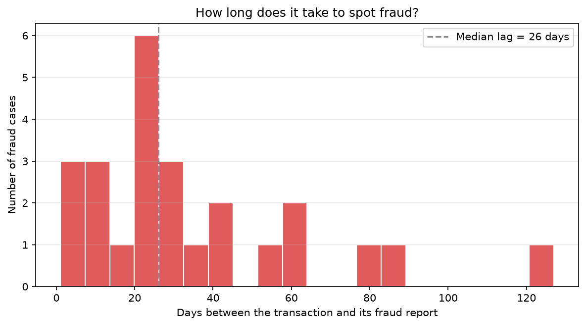
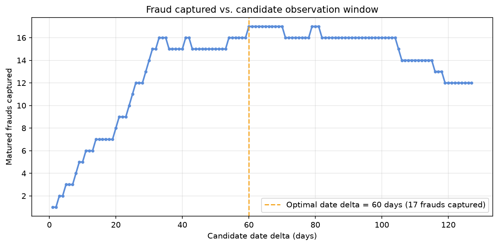

# Data Science stuff I wish I knew sooner: Fraud Date Delta

For a long time I treated a fraud label the same way I treated any other column: it's either `0` or `1`,
end of story. What I was missing is that a fraud label is not a property of the transaction alone, it is
a property of the transaction **and of how long you waited before trusting the label**. Fraud is
practically never known instantly, it is *reported*, days or weeks after the transaction happened, by a
customer disputing a charge, a chargeback landing, or a fraud team closing a case. Until that report
arrives, a fraud that already happened still looks, in your data, exactly like a legitimate transaction.

That gap between "the transaction happened" and "we found out it was fraud" is the **date delta** this
article is about. Get it wrong and one of two things happens: cut the observation window too short and
you train on transactions the model calls "legitimate" simply because fraud hadn't been reported yet
(pure label noise, and it concentrates exactly on the most recent data, the part closest to production).
Cut it too long and you throw away months of otherwise usable history waiting for stragglers that were
never going to show up.

The companion notebook
[`5-Fraud-Date-Delta-Training.ipynb`](5-Fraud-Date-Delta-Training.ipynb) walks through measuring that lag,
finding a defensible observation window from it, and turning that window into a label: one step that is
never optional, and one real choice underneath it. On purpose, **no model is trained** in this notebook,
this is a labelling-strategy article, and the plots and counts are the whole point.

---

## Dataset

[Bank Transaction Dataset for Fraud Detection](https://www.kaggle.com/datasets/valakhorasani/bank-transaction-dataset-for-fraud-detection)
(Kaggle) — 2,512 bank transactions spanning 2023-01-02 to 2024-01-01, with amounts, channels, devices,
locations and a `TransactionDate`. It ships with **no fraud label**, which turns out to be convenient
here: every property of the label discussed below was put there on purpose, nothing is hiding inside a
pre-existing column.

Two fields are added synthetically, both fully reproducible from a single seeded
`numpy.random.Generator`:

* **`IsFraud`** — exactly 1% of rows, chosen with `rng.choice(..., replace=False)`. Using `choice` on row
  positions pins the *count* down exactly, rather than leaving it as an expectation that a coin-flip
  approach (`rng.random() < 0.01`) would only hit approximately.
* **`FraudReportedDate`** — for fraud rows only, `TransactionDate + lag`, where `lag` (in days) is drawn
  from a shifted exponential distribution: most fraud is spotted quickly, a long tail is spotted much
  later. This lag is the whole article, everything below is about how to handle it correctly.

```python
fraud_positions = rng.choice(n_rows, size=n_fraud, replace=False)
lag_days = np.clip(np.round(1 + rng.exponential(scale=50.0, size=n_fraud)), 1, 180)
fraud_date = transaction_date[fraud_positions] + pd.to_timedelta(lag_days, unit="D")
```

---

## 1. How long does it take to spot fraud?



Plotting `FraudReportedDate - TransactionDate` for the 25 fraud cases shows the shape the generator was
designed to produce: a cluster of quick detections in the first few weeks, a median lag of 26 days, and a
thinning tail stretching out past four months. Real fraud-reporting lags look like this too — most
disputes and chargebacks land quickly, but a minority take much longer to surface.

A single "days since transaction" cutoff, picked without looking at this distribution, will either sit
inside the bulk of the tail and silently miss it, or sit far out in the tail and throw away most of the
dataset waiting for stragglers that make up a small fraction of cases.

---

## 2. Finding the optimal date delta

Order transactions by date and call `reference_date` the last transaction date in the data (the end of
the training window). For a candidate window of `d` days:

* a transaction only counts as **mature** for `d` if it happened at least `d` days before
  `reference_date`. Anything more recent hasn't had the full `d` days to be reported yet, so nothing can
  honestly be said about it at that window length;
* among mature transactions, a fraud is **captured** at `d` if it was reported within `d` days of the
  transaction.

At `d = 1`, only frauds reported the next day, among transactions old enough to have had that one day to
prove it, count. At `d = 2`, it's frauds reported within 2 days, among transactions that are at least 2
days older than the end of training, and so on. Growing `d` cuts both ways: it lets in fraud with a
longer reporting lag, but it also shrinks the pool of mature transactions, since the most recent `d` days
keep getting excluded every time `d` grows.

```python
for d in range(1, max_days + 1):
    cutoff = reference_date - pd.Timedelta(days=d)
    is_mature = transaction_date <= cutoff
    is_captured = is_mature & (label == 1) & (date_delta_days <= d)
    captured_frauds[d] = is_captured.sum()

optimal_date_delta = captured_frauds.idxmax()
```



That tension is not incidental, it is what gives this curve its shape in general: **it goes up, then
down**. It climbs steeply while short windows are still missing most of the reporting-lag distribution,
flattens into a plateau once nearly every reportable fraud in the mature population has been captured,
then drifts back down as growing `d` keeps shrinking the mature pool for no further gain, occasionally
ticking back up on the strength of one more straggler before falling again. **60 days** is the optimal
date delta here, the smallest window that captures as many mature frauds (17) as any window realistically
will, this dataset's curve even touches that same value a second time around day 79, at the cost of over
150 extra dropped transactions for nothing extra in return.

That "smallest window" qualifier matters. Several candidate values of `d` typically tie for the peak;
`idxmax` always returns the first one it finds, which is also the cheapest: a larger, tied `d` captures
exactly the same fraud while discarding strictly more mature transactions. Ties should always break
toward the earliest `d`, never arbitrarily.

### The last label is rarely the cheapest one

Reaching the global peak isn't free even before ties enter the picture. Tracking the earliest `d` that
reaches each new best captured-fraud count, and what it cost in dropped transactions, tells a diminishing-returns
story:

| Captured frauds | Earliest `d` (days) | Mature transactions | Dropped |
|---|---|---|---|
| 12 | 26 | 2,342 | 170 |
| 13 | 29 | 2,305 | 207 |
| 14 | 30 | 2,305 | 207 |
| 15 | 31 | 2,304 | 208 |
| 16 | 33 | 2,287 | 225 |
| **17** | **60** | **2,085** | **427** |

Every step from 12 to 16 captured frauds costs a handful of additional dropped rows. The very last step,
16 to 17, costs **202 more rows on its own — almost as much as every earlier step combined** — for exactly
one extra fraud case. `get_optimal_date_delta` still returns the strict global optimum (60 days) by
default, and that is the right default to ship with. But a team looking at this table is not wrong to
decide the last row's price tag isn't worth it, and to pick `d = 33` instead: 16 captured frauds for 225
dropped rows, rather than 17 for 427. Either choice is defensible; the mistake would be picking `d`
without ever seeing this trade-off.

---

## 3. Turning a date delta into a label — one mandatory step, one real choice

Picking `optimal_date_delta = 60` answers "how many days of reporting lag should the label definition
tolerate?". Applying that answer to the training data always does one thing first, then makes one choice:

**Always: drop the immature tail.** Every transaction from the last 60 days of the dataset is excluded
outright. We genuinely do not know yet whether they will turn into fraud within the window, so there is
no safe default for them — this isn't one of the two strategies, it happens either way.

**Then, a choice.** Among what's left (transactions old enough to have had the full 60 days), a handful
may have been confirmed as fraud, but only *after* the window had already closed. That late-discovered
fraud no longer satisfies the window's own definition — "fraud, if reported within 60 days" — so what
happens to those specific rows is genuinely a choice:

1. **Relabel to legitimate (0), the default.** The row stays, answering the narrower, time-boxed
   question the label is now defined around ("was this confirmed fraud within 60 days"), rather than the
   unbounded one ("is this fraud, ever").
2. **Drop the row entirely.** Nothing forces a transaction that is *definitely* fraud to carry a
   "legitimate" label; the cost is a smaller dataset rather than a contradicted one.

| | Rows | Fraud count | Fraud ratio |
|---|---|---|---|
| Original (synthetic ground truth) | 2,512 | 25 | 0.995% |
| **Relabel late fraud to legitimate** | 2,085 (427 dropped) | 17 | 0.815% |
| **Drop late fraud entirely** | 2,083 (429 dropped) | 17 | 0.816% |

Both modes agree on almost the entire dataset here: the immature tail is gone either way, and every
mature transaction with a reporting lag of 60 days or less keeps its original label either way. The only
disputed rows are the 2 mature transactions confirmed as fraud more than 60 days after the fact.
Relabelling keeps them as legitimate-for-this-window; dropping removes them so nothing in the training
set ever contradicts a confirmed outcome. Two rows either way, not a dramatic difference, and that's the
point: this window was chosen (Section 2) right at the point where the maturity curve has already
captured nearly every reportable fraud, so almost none are left over to disagree about.

That is not guaranteed at a worse window. Picking a shorter, more naive `d` (14 or 20 days, both well
before the plateau) leaves 17-18 rows in dispute instead of 2, several of them fraud that "relabel" keeps
as label-1 evidence for the narrower window and "drop" discards instead. Choosing `d` well and choosing
how to treat late fraud are not independent decisions: a good `d` makes the second choice nearly moot, a
poor one makes it consequential.

```python
relabel_df = analyzer.apply_date_delta_window(optimal_date_delta, drop_late_fraud=False)
remove_df  = analyzer.apply_date_delta_window(optimal_date_delta, drop_late_fraud=True)
```

---

## What to do about it

A fraud definition is a **time-bound** definition, "fraud, if reported within `d` days", whether a team
writes that down explicitly or not. Once `d` is chosen:

1. **Measure the reporting lag before picking a window.** A histogram of the lag distribution
   (Section 1) tells you whether a given `d` is realistic; picking one blind is picking blind twice, once
   for the cutoff and once for how much of the tail it actually covers.
2. **Never default an unproven row to "not fraud".** The temptation is to keep every row because it
   feels like free data. It isn't. It's label noise, and it concentrates on the rows closest to
   production, exactly where a model's mistakes are most expensive.
3. **Dropping the immature tail isn't optional, and that's fine.** It costs recent rows, sometimes even a
   handful of already-confirmed frauds sitting right at the edge of the window. That cost is small and
   known. The cost of mislabelled rows is neither, so there is nothing to weigh here.
4. **What to do with late-discovered fraud is the actual choice, and it's a small one if `d` is good.**
   Relabelling it legitimate answers a narrower, time-boxed question; dropping it avoids ever
   contradicting a confirmed outcome. Both are defensible — what matters is picking one on purpose, and
   noticing that the choice barely moves the needle once `d` already sits near the peak.
5. **Expect the maturity curve to peak, and break ties toward the smallest `d`.** It climbs, then falls,
   because the two effects it balances (more lag tolerated, less mature data left) pull in opposite
   directions. When several windows tie for the best fraud count, the smallest one is strictly better,
   never just a tie-breaking convention.
6. **Look at the price of the last label before paying it.** The step from the second-best window to the
   true optimum is often far more expensive, in dropped transactions, than every earlier step combined.
   Taking the strict optimum by default is reasonable; taking it without checking what it cost is not.
7. **Revisit `d` as reporting behaviour changes.** A fraud team that gets faster (or slower) at closing
   cases shifts the whole lag distribution, and the optimal date delta with it. This isn't a constant to
   set once.

---

## Running the notebook

```bash
cd 5-fraud-date-delta-training
uv sync
uv run jupyter notebook
```

Or in VS Code: open `5-Fraud-Date-Delta-Training.ipynb` and select the `.venv` kernel.

---

## References

- [Bank Transaction Dataset for Fraud Detection (Kaggle)](https://www.kaggle.com/datasets/valakhorasani/bank-transaction-dataset-for-fraud-detection)
- [numpy.random.Generator](https://numpy.org/doc/stable/reference/random/generator.html)
